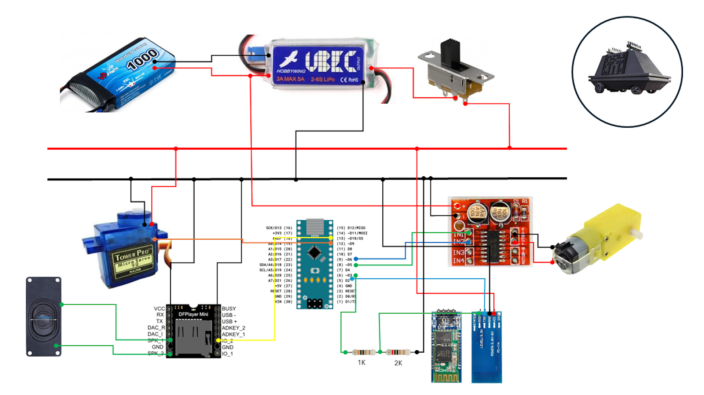

# Introduction 
This is the Arduino code to run the 3D Printed ME-6 Mini Mouse.

You can find a video on how to build the droid on this channel: https://www.youtube.com/@jakobleander

# Getting Started
Connect all the components like this

Run the various tests in the HardWare folder first to ensure each component is wired up correctly.

When all is working you can upload the full application in ME6 folder to the robot.

# To control the robot
You can control the robot from a bluetooth device (not IOS) that can send serial commands.

I like to use this android serial app https://play.google.com/store/apps/details?id=de.kai_morich.serial_bluetooth_terminal&hl=en

Or for more advanced robot make my own bluetooth enabled app in Unity.

To move the robot you send serial commands. The commands are in the format a character followed by a single digit.

The commands must be wrapped by () to reduce risk of corrupted commands
- '(D#)' = Drive 1 second, e.g. D1 = max backward, D5 = stop, D9 = max forward
- '(T#)' = Turn, e.g. R0 = straight, R1 = maximum left, R9 = maximum right
- '(S0)' = Play sound